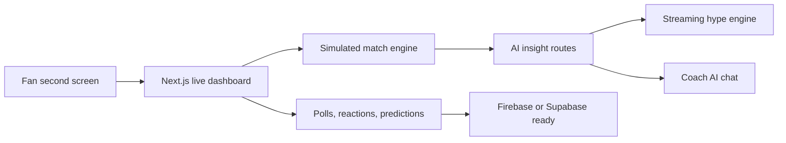

<div align="center">


[](https://pulseplay-ai-tau.vercel.app)
[](https://nextjs.org)
[](https://www.typescriptlang.org)
[](https://tailwindcss.com)
[](#ai-integration)

**A cinematic live sports companion app that turns passive viewing into an interactive, AI-powered second-screen experience.**

[View Live App](https://pulseplay-ai-tau.vercel.app) · [Features](#features) · [Run Locally](#quick-start) · [Deploy](#deployment)

</div>

---

## Overview

**PulsePlay AI** is a hackathon-ready sports second-screen platform built for fans watching live matches. It combines a premium live dashboard, simulated realtime event engine, fan interaction layer, AI match analysis, streaming hype commentary, and personalization controls.

The experience is inspired by the energy of ESPN, Apple Sports, Twitch chat, and Formula 1 telemetry dashboards.



## Live Demo

Production deployment:

**https://pulseplay-ai-tau.vercel.app**

The app works out of the box in demo mode with realistic mock sports data. Add OpenAI or Gemini keys to enable real AI generation.

## Features

| Area | What It Does |
| --- | --- |
| Live Match Dashboard | Score, timer, possession, shots, xG, passes, fouls, live indicators, and recent event timeline |
| AI Match Insights | Tactical insight, momentum shifts, player summaries, game-changing analysis, and predicted next events |
| Second-Screen Fan Layer | Live polls, emoji reactions, prediction games, trivia, sentiment meter, and sticky mobile action bar |
| AI Hype Engine | Streaming dramatic commentary, social-style reactions, meme captions, and recap-ready text |
| Smart Event Detection | Simulates goals, saves, fouls, substitutions, clutch moments, cards, injuries, and penalties |
| Personalization | Favorite team, favorite players, and commentary tones: analytical, funny, emotional, Gen Z |
| Wow Visuals | AI heatmap, crowd excitement meter, win probability graph, instant replay popup, animated sports field |
| Coach AI | In-app assistant for tactical questions and live match explanations |

## Tech Stack

- **Framework:** Next.js 15 App Router
- **Language:** TypeScript
- **Styling:** TailwindCSS
- **Animation:** Framer Motion
- **Icons:** Lucide React
- **AI:** OpenAI API or Gemini API
- **Realtime Ready:** Firebase or Supabase helpers
- **Deployment:** Vercel

## Screens

### Landing + Demo Preview

Premium dark sports UI with animated field visuals, glass panels, CTA controls, and live dashboard preview.

### Live Dashboard

Realtime-feeling match state with score, clock, momentum, possession, stats, heatmap, event timeline, and win probability.

### Fan Zone

Polls, predictions, trivia, reactions, sentiment, voice assistant button, and mobile sticky controls.

### AI Layer

Coach AI insight cards, streaming hype commentary, replay analysis, and personalized tone adaptation.

## Quick Start

```bash
npm install
npm run dev
```

Open:

```text
http://localhost:3000
```

On Windows PowerShell, if `npm` is blocked by script execution policy:

```bash
npm.cmd install
npm.cmd run dev
```

## Environment Variables

Create `.env.local` from `.env.example`.

```bash
cp .env.example .env.local
```

### OpenAI

```bash
OPENAI_API_KEY=your_openai_key
OPENAI_MODEL=gpt-4o-mini
```

### Gemini

```bash
GEMINI_API_KEY=your_gemini_key
GEMINI_MODEL=gemini-1.5-flash
```

If both providers are configured, API routes prefer OpenAI first.

### Firebase Optional

```bash
NEXT_PUBLIC_FIREBASE_API_KEY=
NEXT_PUBLIC_FIREBASE_AUTH_DOMAIN=
NEXT_PUBLIC_FIREBASE_PROJECT_ID=
NEXT_PUBLIC_FIREBASE_STORAGE_BUCKET=
NEXT_PUBLIC_FIREBASE_MESSAGING_SENDER_ID=
NEXT_PUBLIC_FIREBASE_APP_ID=
```

### Supabase Optional

```bash
NEXT_PUBLIC_SUPABASE_URL=
NEXT_PUBLIC_SUPABASE_ANON_KEY=
```

## AI Integration

PulsePlay AI includes API routes that gracefully fall back to local generated copy when no provider key is set.

| Route | Purpose |
| --- | --- |
| `POST /api/hype` | Streams live hype commentary |
| `POST /api/insights` | Returns tactical match insight JSON |
| `POST /api/coach` | Powers Coach AI chat responses |
| `GET /api/match/state` | Demo match state endpoint |
| `POST /api/polls/vote` | Poll vote endpoint scaffold |
| `POST /api/predictions` | Prediction endpoint scaffold |

Example insight response:

```json
{
  "tacticalInsight": "NYC are controlling second balls through coordinated pressure.",
  "momentumShift": "78 momentum index after the latest goal.",
  "playerSummary": "Maya Chen is stretching the back line with near-post runs.",
  "changedGame": "The press now forces rushed clearances.",
  "predictedNextEvent": "NYC force a box entry from the right channel."
}
```

## Realtime Architecture

The app currently uses a rich local simulation engine so the demo works anywhere. The realtime integration points are already prepared in `lib/realtime.ts`.

Suggested realtime channels:

- `match:{matchId}:state`
- `match:{matchId}:events`
- `match:{matchId}:polls`
- `match:{matchId}:reactions`
- `match:{matchId}:predictions`
- `match:{matchId}:coach-ai`

## Project Structure

```text
app/
  api/
    coach/
    hype/
    insights/
    match/state/
    polls/vote/
    predictions/
  globals.css
  layout.tsx
  page.tsx
components/
  ui/
  ai-insights.tsx
  charts.tsx
  coach-chat.tsx
  fan-zone.tsx
  hype-engine.tsx
  live-dashboard.tsx
  preferences-panel.tsx
  sticky-action-bar.tsx
lib/
  ai.ts
  mock-data.ts
  realtime.ts
  simulation.ts
  types.ts
  usePreferences.ts
  useSyncHooks.ts
  utils.ts
```

## Scripts

```bash
npm run dev
npm run build
npm run start
```

## Deployment

The app is Vercel-ready.

```bash
npm run build
vercel deploy --prod
```

Production URL:

**https://pulseplay-ai-tau.vercel.app**

## Why It Stands Out

- Feels live even without paid sports data APIs
- AI responses adapt to fan preferences and match state
- Uses streaming responses for a more realistic broadcast feel
- Mobile-first second-screen experience with sticky fan actions
- Strong visual identity built around sports telemetry, crowd energy, and realtime motion

## Roadmap

- Real sports data provider integration
- Authenticated fan profiles
- Match rooms with shared realtime chat
- Push notifications for key moments
- Audio voice mode for Coach AI
- Post-match AI highlight report

## License

MIT

<div align="center">

Built for fans who watch the match and the momentum.


</div>
